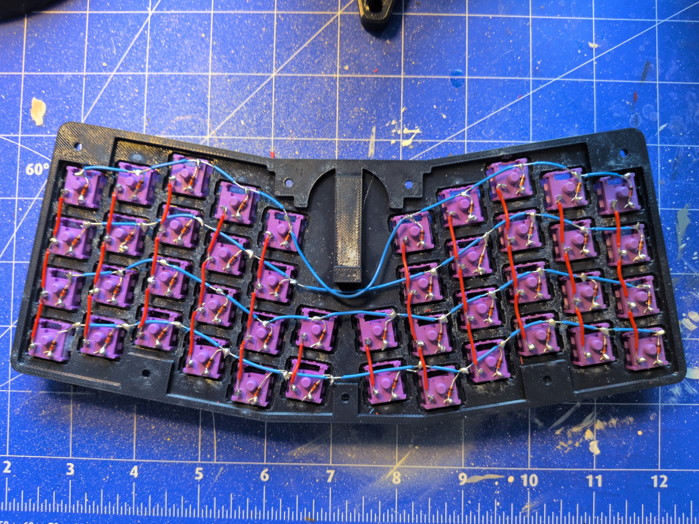
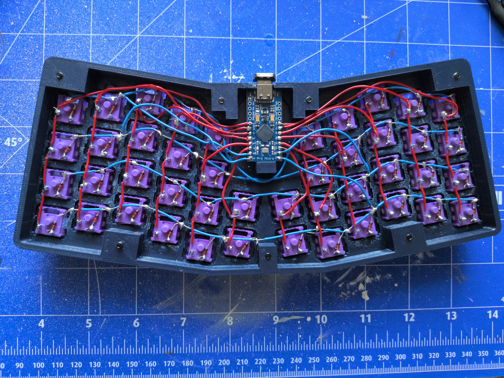
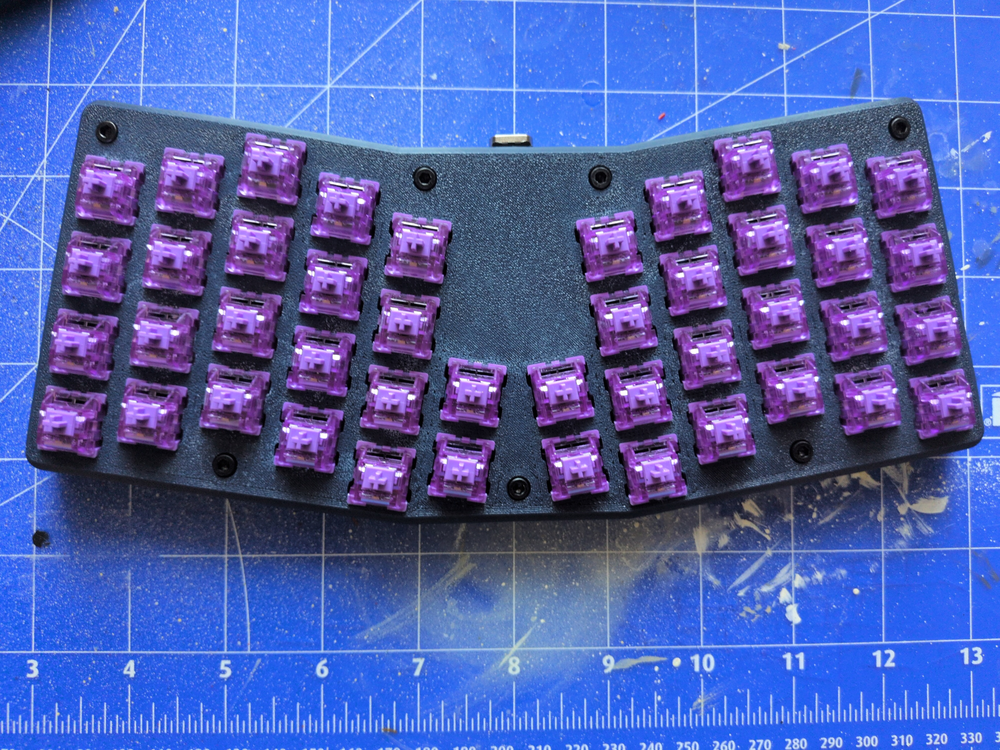
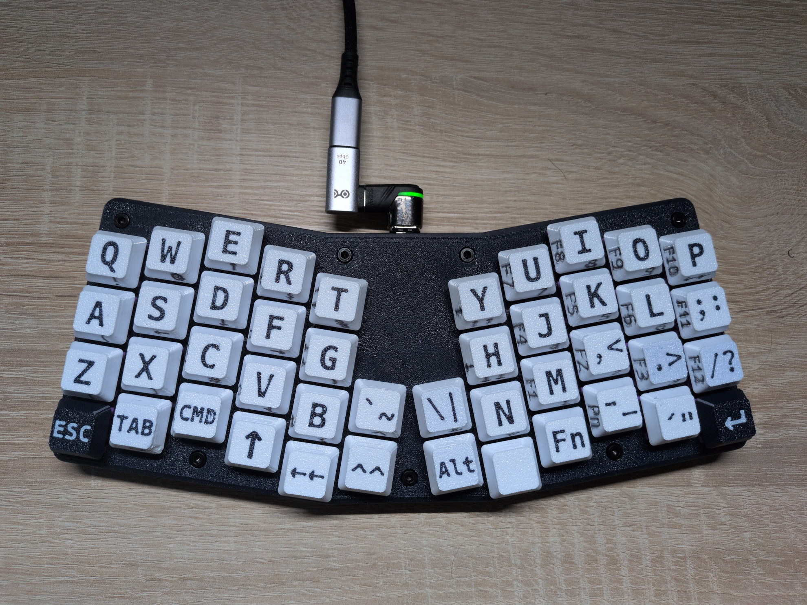

# Atreus

This is my handwired build of an "Atreus" keyboard.
It is mostly based on open source model files that i slightly modified.

What is modified:

* add mount for pro-micro controller with usb port accessible (the original model is designed to attach a usb cable inside the case)
* moved two screw holes to leave place for the new conroller placement
* scaled keycaps and added legends to it

Links to the original files can be found in the corresponding sub-directories.

## Images

The handwired keyboard matrix:

with the controller wired:

case assembled:

fully assembled with 3d printed keycaps:

