# Klasa

The "Klasa" is a 36-key, columnar-staggered split keyboard.
After using ortholinear and some columnar-staggered keyboards for a while, I wanted a keyboard somewhere in between: not fully ortho, yet also not as steeply columnar-staggered as most columnar-staggered boards.

## Design-Goals

* handwired
* uses Gateron KS-33 low-profile or MX sized switches 
* 36 keys (with [https://onedeadkey.github.io/selenium/](https://onedeadkey.github.io/selenium/) in mind)
* wired with usb-c interconnect
* use a partial column stagger: keys are still column-staggered, just with a smaller offset than common columnar-staggered keyboards
* make use of self tapping screws (no heated inserts) and screwed together from the bottom
* compact and portable (to use on the go)

## Design decisions

* no tilting or tenting built into the case - maybe realized in the future through accessories like a stand. Keeping it out of the case makes printing and assembly easier and keeps the keyboard compact
* not as flat as possible - a flat keyboard would be nice but not at all costs, hence the choice of Gateron KS-33 switches and full MX switch compatibility
* serial instead of I2C simply because I don't had the resistors for I2C available.

## Bill of Materials

| Item | Description | Quantity | Comment/Image |
|:--- |:--- |:--- |:--- |
| **Switches** | Gateron KS-33 Switches or MX Switches | 36 |  |
| **Controller** | Pro Micro | 2 | 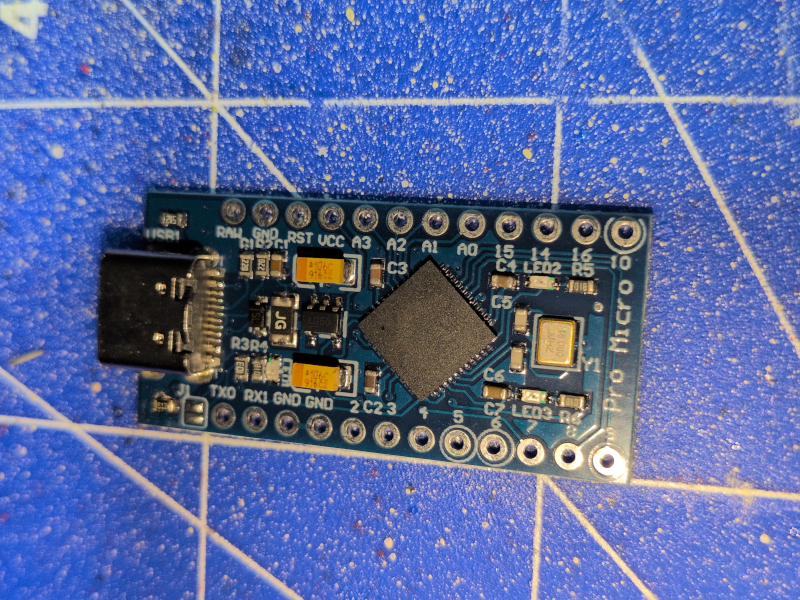 |
| **Diodes** | 1N4148 Diodes | 36 | |  
| **Hardware** | M2 6mm self tapping screws | 28 | 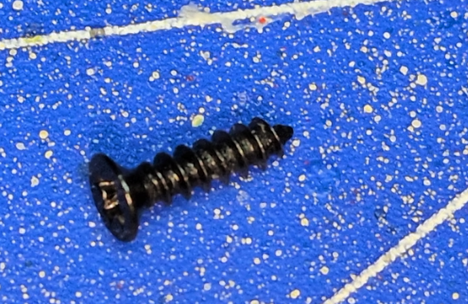  |
| **Breakout Board** | USB-C Breakout Board | 2 | 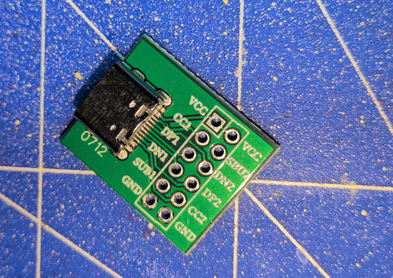 |
| **Misc** | wire (Solid core recommended) | - | |
| **Optional** | Rubber feet | - | |

## Wiring

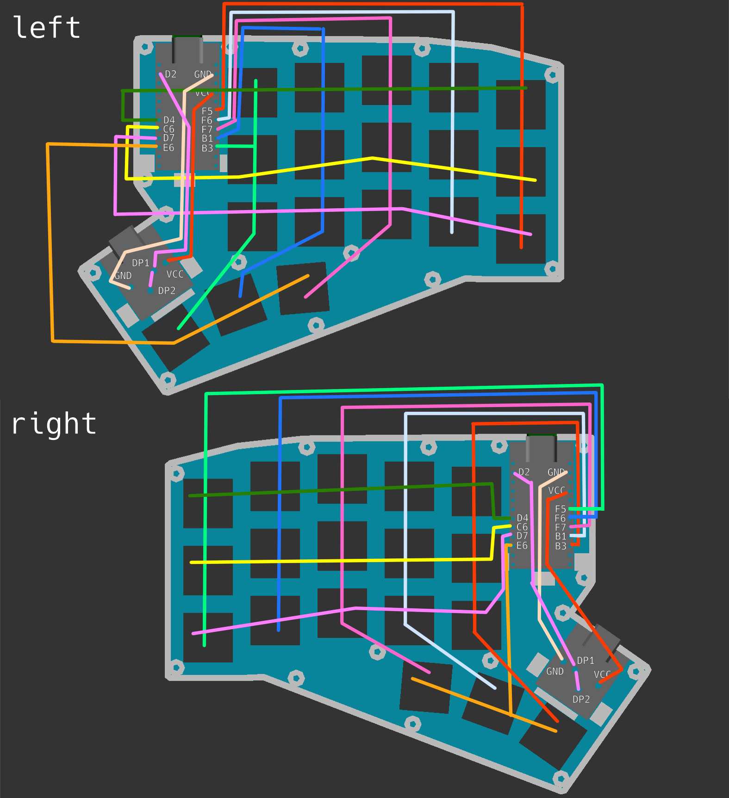

Real wiring of the left half:

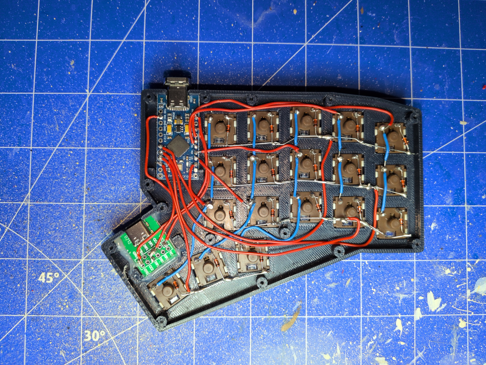

## Firmware

Firmware (QMK) is located here: [https://github.com/sorcerersr/qmk_firmware/tree/klasa/keyboards/klasa](https://github.com/sorcerersr/qmk_firmware/tree/klasa/keyboards/klasa)

## Assembled Keyboard

Left half assembled using Gateron KS-33 Chocolate switches but without keycaps:

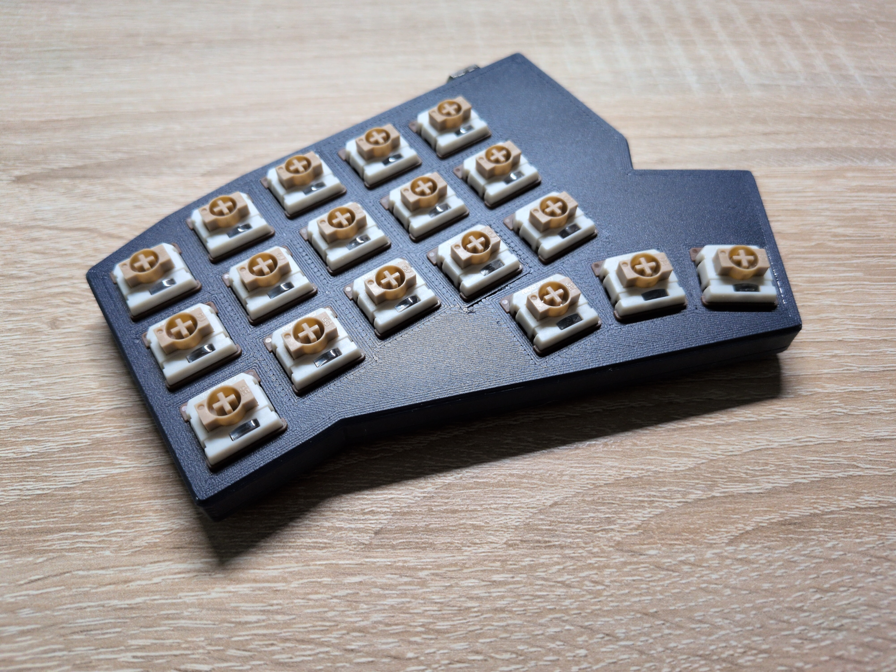

Fully assembled and connected. Keycaps are [KLP Lamé](https://github.com/braindefender/KLP-Lame-Keycaps) with legends for [selenium](https://onedeadkey.github.io/selenium/). Case is printed using Sunlu PETG Midnight and Keycaps are printed using Sunlu PETG Ceramic White.

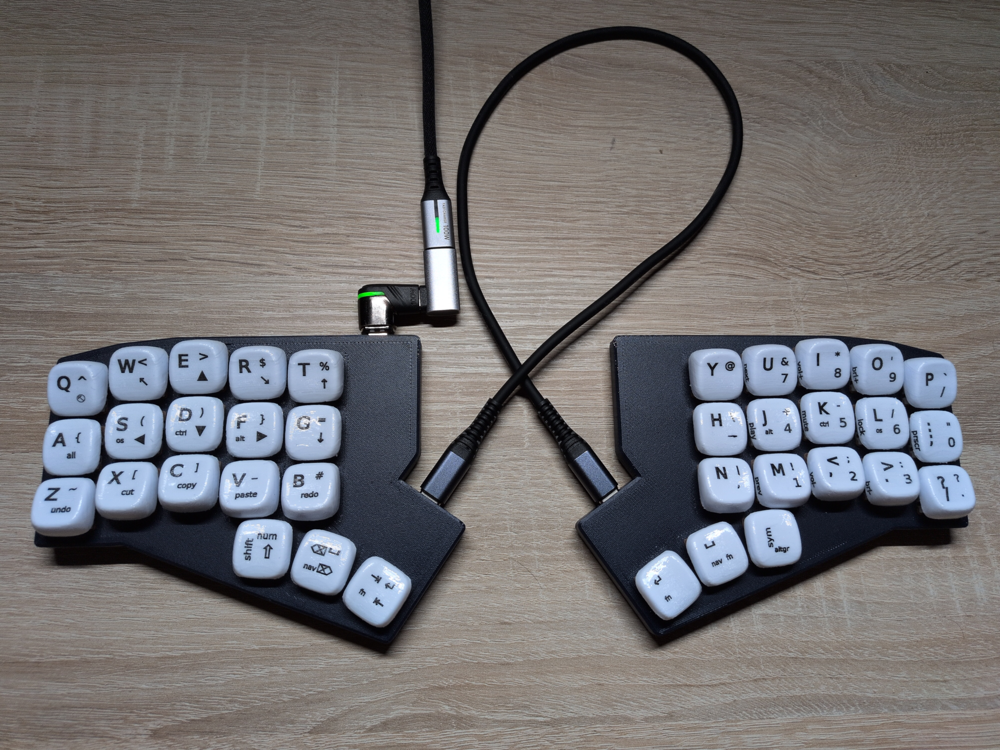

## Case

Each half has two parts: a top and a bottom. STL files can be found here [STLs](https://github.com/sorcerersr/sorckb/tree/main/03_klasa/stl) or can be generated yourself with the *export_stls.sh* script (on linux with OpenSCAD nightly installed as flatpak) or just manually from the *.scad*-files.

Print settings: Nothing fancy. All case parts print without supports. I used 4 walls and 0.2 layer height.

Personal preference: printing on a smooth build plate just looks and feels better:

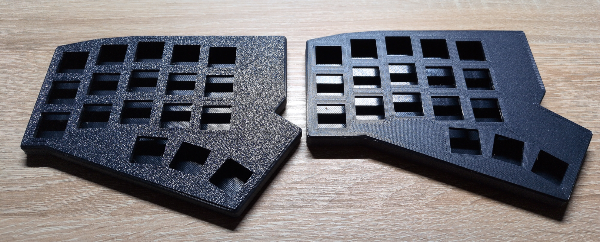
On the left is an early prototype printed on a textured build plate and on the  right is a more recent prototype printed on a smooth build plate.

## MX Switches

The case was designed with the intention to use Gateron KS-33 switches but regular MX sized switches fit as well although there is not much space left.

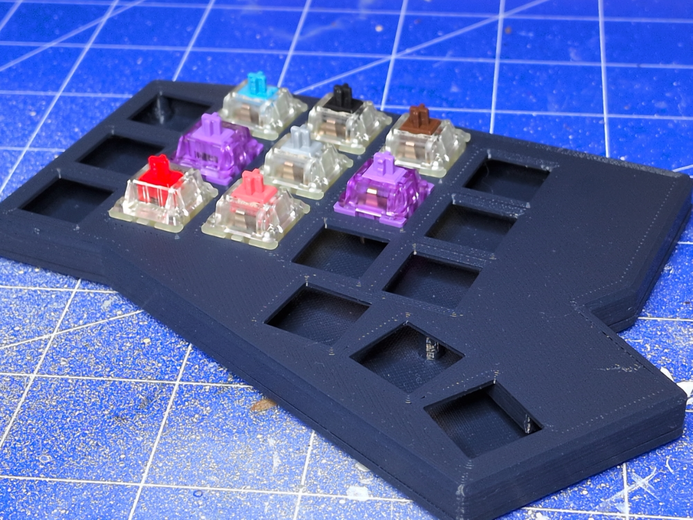

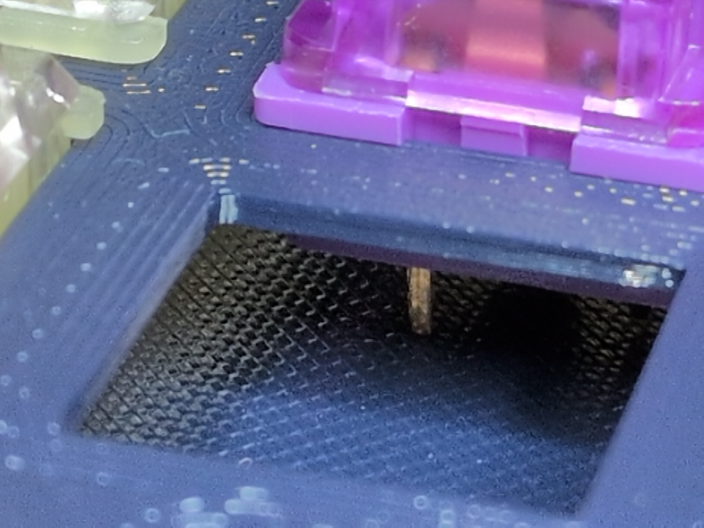

## Accessories

### Transport Box

A transportation box for the Klasa keyboard. 

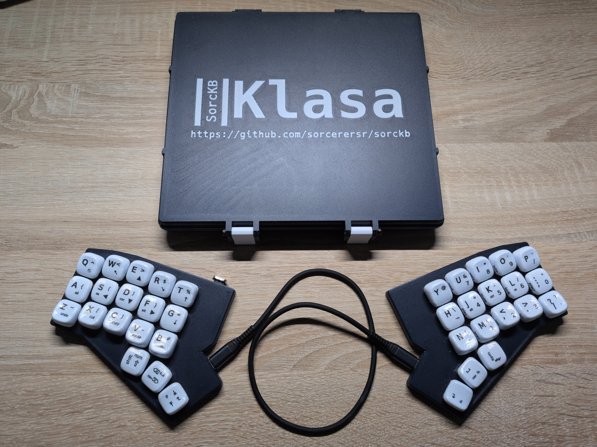

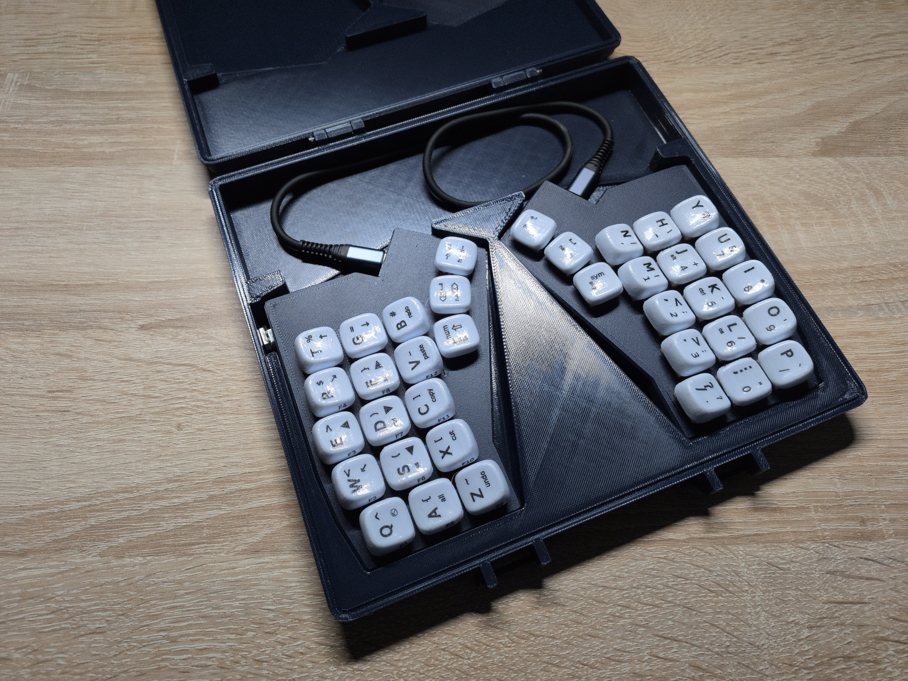

Project files can be found here: [The Klasa Transportation Box](./accessories/box/README.md)
