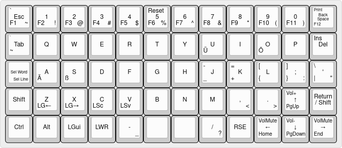

# sorckb
This repository contains the files for my self build ortholinear keyboard.

## Layout

The layout is intended to be used with the 'us-altgr-intl' keymap to benefit from 
a developer friendly english base layout but also have the opportunity to write german umlauts
accessible on a different layer. There are two layers: a upper and a lower layer. 

Layout on KLE: http://www.keyboard-layout-editor.com/#/gists/82cacdce1a3e26ae7781c8b55252cb77

## Switchplate

The [switchplate](switchplate.svg): 
was made using: http://builder-docs.swillkb.com/