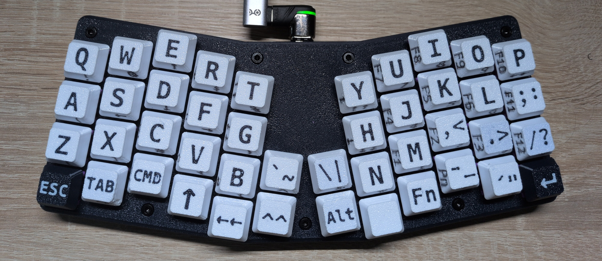
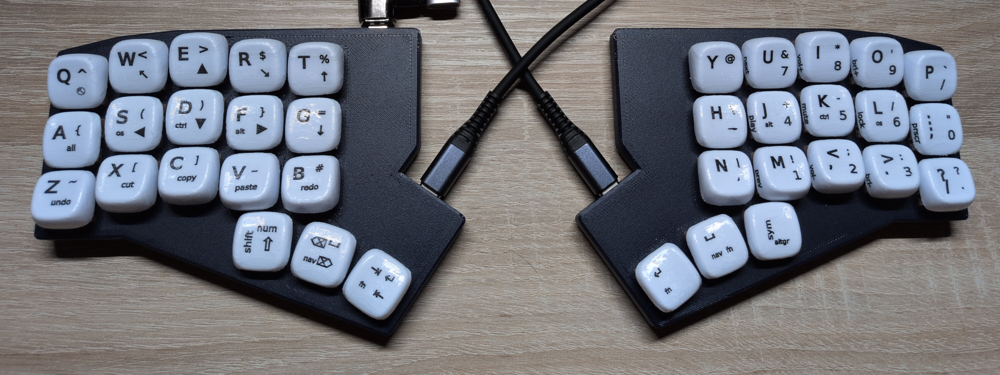

# A collection of my self build keyboards

## Ortho

Not finished: [Ortho](./01_ortho/README.md).
My take to self build an ortho-linear keyboard inspired by the "Preonic".

## Atreus

My handwired build of an "Atreus" keyboard: [Atreus](./02_atreus/README.md).

## Klasa

The "[Klasa](./03_klasa/README.md)" is a 36-key, columnar-staggered split keyboard I designed from scratch and my current daily driver. 

